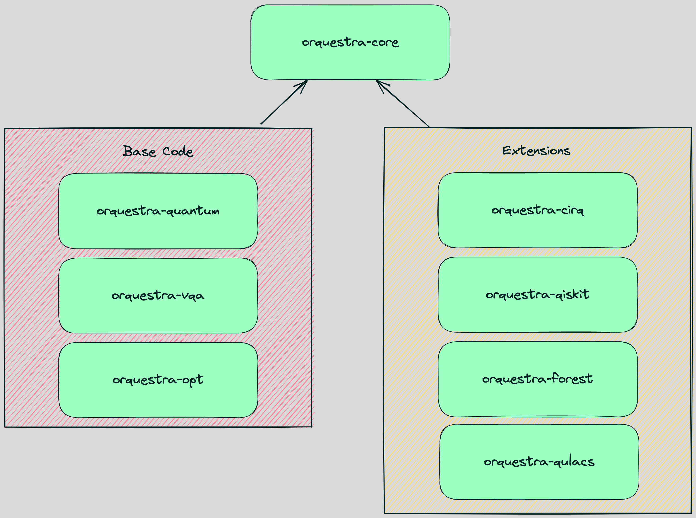

.. _orq_core_structure:

=================
Package Structure
=================

As shown in the diagram below, Orquestra Core is broken into multiple packages, each with a different purpose.

.. list-table::
  :widths: 30 70
  
  * - `orquestra-quantum <https://github.com/zapatacomputing/orquestra-quantum>`_
    - Data structures and interfaces describing fundamental concepts in quantum computing such as circuits and backends.
  * - `orquestra-opt <https://github.com/zapatacomputing/orquestra-opt>`_
    - Data structures, interfaces, and utilities related to continuous and discrete optimization.
  * - `orquestra-vqa <https://github.com/zapatacomputing/orquestra-vqa>`_
    - Implementations of common variational quantum algorithms including VQE, QAOA, and QCBM.
  * - `orquestra-qiskit <https://github.com/zapatacomputing/orquestra-qiskit>`_
    - Integration with `Qiskit <https://qiskit.org/>`_.
  * - `orquestra-cirq <https://github.com/zapatacomputing/orquestra-cirq>`_
    - Integration with `Cirq <https://quantumai.google/cirq>`_ and :ref:`Nvidia's custatevec backend <backends>`.
  * - `orquestra-forest <https://github.com/zapatacomputing/orquestra-forest>`_
    - Integration with `Rigetti Forest <https://pyquil-docs.rigetti.com/en/stable/>`_.
  * - `orquestra-qulacs <https://github.com/zapatacomputing/orquestra-qulacs>`_
    - Integration with the `Qulacs simulator <https://github.com/qulacs/qulacs>`_.
  * - `orquestra-braket <https://github.com/zapatacomputing/orquestra-braket>`_
    - Integration with `Amazon Braket <https://aws.amazon.com/braket/>`_.

Dividing Orquestra core into multiple packages creates provides a number of benefits:

* It makes the code more modular and helps creating clear boundaries between the libraries.
* A lot of packages that we rely on are unstable - by dividing code into multiple separate packages, we reduce the risk of one unstable dependency breaking all of them.
* Users have more control over what they want and need to install.
* Both points above reduce the risk that the user will end up with conflicting dependencies with some other packages they might be using.
* It is easier to develop them separately.
