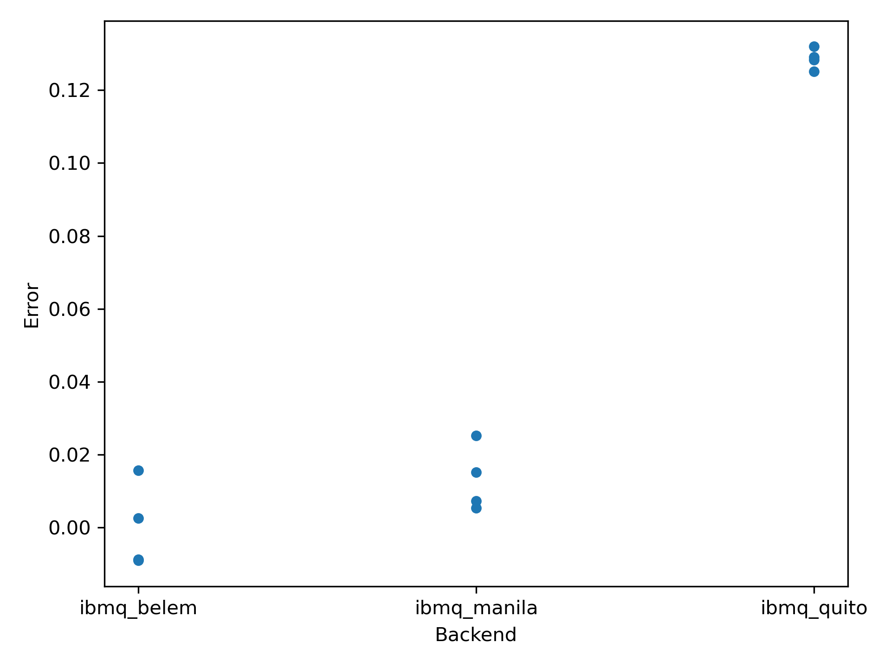

==========================
Running VQE on IBM Quantum
==========================

As a quantum scientist, you are often interested in comparing the performance of quantum devices for a given application. In practice, such a comparison can be quite complicated both because of the complexity of the underlying algorithm, but also the complexity of managing access to a quantum hardware provider and organizing your data.

This recipe will show how to use Orquestra to compare the performance of VQE across several IBM Quantum devices. It leverages the Orquestra Workflow SDK to run multiple calculations in parallel and keep a record of results, as well as the Orquestra Quantum SDK's implementation of VQE and integration with IBM Quantum.

Setup
=====

Installing Dependencies
-----------------------
In addition to having :doc:`Orquestra Core installed <../getting_started>`, this recipe also requires pandas.
If you do not already have pandas installed, you can install it with the following command:

.. code-block:: bash

   pip install pandas

Starting Ray
------------
If you are running locally, follow :doc:`the instructions for starting Ray<../sdk/tutorials/ray>`.
If you are using Orquestra Portal, you can skip this step.

Configuring IBM Quantum Credentials
-----------------------------------
Follow the steps below to obtain and configure IBM Quantum credentials:

#. Follow the instructions `here <https://quantum-computing.ibm.com/account>`_ to create an IBMid account.
#. Copy your API token from the IBM Quantum dashboard.
#. Insert your token into the command below and run it:

.. code-block:: bash

   python -c "from qiskit import IBMQ; IBMQ.save_account('your-token-here')"

Running the Workflow
====================
Create a new directory and copy the following code into a file called ``workflow.py``:

.. literalinclude:: ../examples/vqe/workflow_defs.py
   :language: python
   :start-after: Start

This workflow will use a simulator to find the optimal parameters for a two-qubit transverse field Ising model, and then use the optimized parameters to calculate the ground state energy using different IBM Quantum devices.
In order to assess the statistical signifance of results, the experiment will be repeated multiple times on each devices.

To run the workflow, create a new file called ``run_workflow.py`` with the contents:

.. literalinclude:: ../examples/vqe/run_workflow.py
   :language: python
   :start-after: Start

This script will create a workflow that runs VQE on three IBM Quantum devices, repeating four times on each.

Run the workflow by running the following command in your terminal:

.. code-block:: bash

   python run_workflow.py

Copy the workflow ID that is printed to the terminal and paste it into the following command to monitor the progress of the workflow:

.. code-block:: bash

   orq wf view <workflow-id>

.. note::

    If you are :doc:`executing your workflows remotely on Quantum Engine <../tutorials/python-api-qe>`, see instructions :doc:`here <../tutorials/secrets>` for storing your API token as an Orquestra secret and using it to initialize the circuit runner.

Visualizing Results
===================
Once the workflow is complete, visualize the results by creating a new file called ``visualize_results.py`` with the contents:

.. literalinclude:: ../examples/vqe/visualize_results.py
   :language: python
   :start-after: Start

Replace the workflow run ID on line 6 of the script with the ID of your workflow run, and then execute the script with the command:

.. code-block:: bash

   python visualize_results.py

This should result in a plot similar to the one below:

The plot shows the error in the ground state energy for each trial on each device.
The experiments show a statistically significant difference in the performance of the devices, with IBMQ Belem performing the best.
