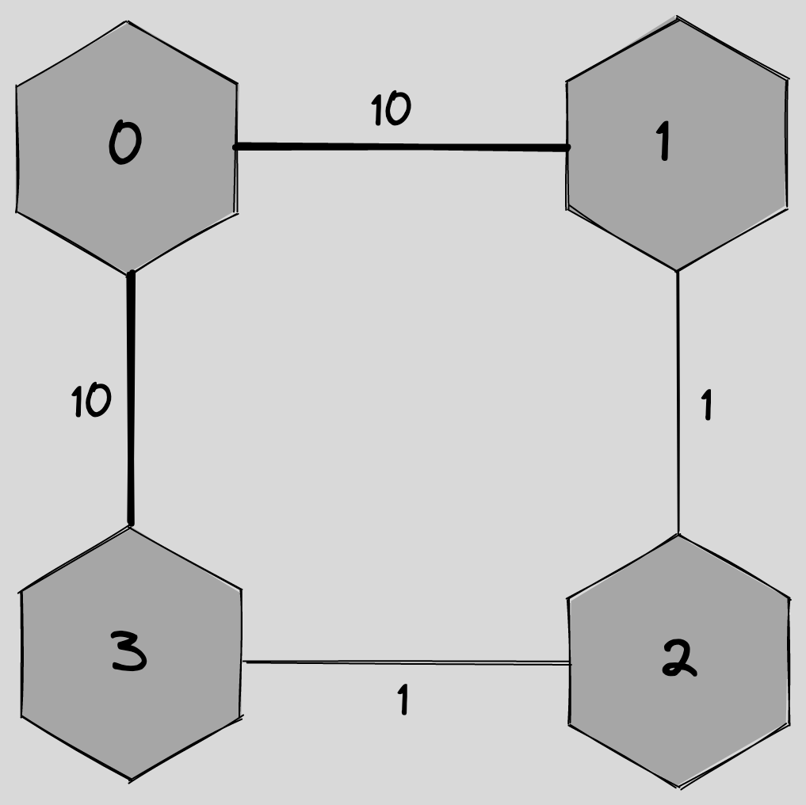
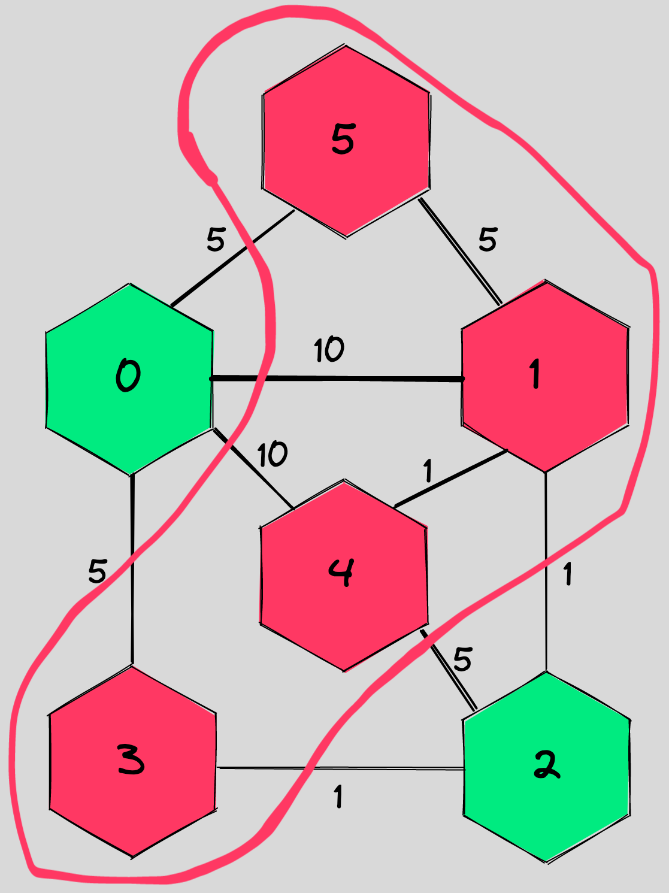

========================
Solving MaxCut with QAOA
========================

.. _qaoa_tutorial:

It's 3 in the morning and your boss calls you, waking you up from your sleep: "I got a problem I need you to solve." 

Okay, what could this be? 

"I need to cut a graph in a way that maximizes the value of the edges cut" 

Ahhhh this dream again.

In all seriousness, what I'm describing here is called the MaxCut problem. Given some graph, we want to cut it into two parts so that the value of the "cut" edges is maximized. For instance, let's take this graph:

How could you split each of the nodes into one of two categories such that the line that circles one category (but not the other) cuts edges in such a way that the sum of the edges is maximized?

Maybe you saw the answer right away: if we circle the nodes on the top right and bottom left of the graph, we cut through all of the edges!

.. image:: images/cut_graph.excalidraw.png
    :width: 50%
    :align: center

That was a pretty easy example, but now try to find a solution for this one:

.. image:: images/harder_graph.excalidraw.png
    :width: 50%
    :align: center

All I've done is add 2 nodes and a couple edges to connect them up to the graph (plus changing one edge weight), but the problem has become significantly harder! You can see why this problem will get very computationally expensive very quickly. I don't know about you, but I'd rather not sit here and try to solve that by hand. Let's make Orquestra Core do it for us!

The `Quantum Approximate Optimization Algorithm <https://www.mustythoughts.com/quantum-approximate-optimization-algorithm-explained>`_ is a heuristic quantum algorithm that is believed to offer some advantage in solving optimization problems. It's also very easy to work with in Orquestra! We can use that to try to solve this maxcut problem.

Let's start by creating a new python file called ``qaoa_maxcut.py``. The first thing we'll do is import all the necessary packages:

.. literalinclude:: ../examples/tutorials/qaoa_maxcut.py
    :language: python
    :start-at: from collections import Counter
    :end-at: from icecream import ic

.. include:: ../tutorials/beginner_tutorial.rst
    :start-after: icecream-note:
    :end-before: This will output a text description of the circuit

Now that the imports are out of the way, we can start by making a function that defines our graph. We use the ``networkx`` / ``nx`` package for this:

.. literalinclude:: ../examples/tutorials/qaoa_maxcut.py
    :language: python
    :start-at: def create_harder_graph():
    :end-at: # YOUR CODE HERE

That code only makes the simpler, box-looking graph from the easy maxcut example. In your own code, in new lines after the ``# YOUR CODE HERE``, go ahead and add the remaining lines of the function to define edges between the new nodes I added in the harder problem.

.. hint::

    You should add 5 more edges to your graph and end the function with a ``return graph``.

Here's the solution to that little exercise if you want it:

.. hint::
    :class: dropdown

    .. literalinclude:: ../examples/tutorials/qaoa_maxcut.py
        :language: python
        :start-at: graph.add_edge(0, 4, weight=10)
        :end-at: return graph

Now let's write a function that accepts our graph object and uses QAOA to try to solve it. The first step is to get a description of the problem in a language our quantum computer can understand, we call this the Hamiltonian. We also need a quantum circuit we can train using QAOA, this is called our ansatz.

.. literalinclude:: ../examples/tutorials/qaoa_maxcut.py
    :language: python
    :start-at: def solve_maxcut_qaoa(test_graph):
    :end-at: qaoa = QAOA.default(cost_hamiltonian=hamiltonian, n_layers=2)

Notice we didn't have to build up the Hamiltonian or ansatz ourselves, Orquestra Core just did that for us! MaxCut isn't the only problem we can do that for, either. The ``opt`` part of Orquestra Core has `a number of problems <https://github.com/zapatacomputing/orquestra-opt/tree/main/src/orquestra/opt/problems>`_ readily solvable like `graph partition <https://github.com/zapatacomputing/orquestra-opt/blob/main/src/orquestra/opt/problems/graph_partition.py>`_ and `vertex cover <https://github.com/zapatacomputing/orquestra-opt/blob/main/src/orquestra/opt/problems/vertex_cover.py>`_. Similarly, we can select from a `number of ansatzes <https://github.com/zapatacomputing/orquestra-vqa/tree/main/src/orquestra/vqa/ansatz>`_.
If you are familiar with QAOA, you might have noticed, that we did not specify a lot of details, such as what ansatz or optimizer do we want to use. That's because in this tutorial we will rely on the "default" version of QAOA which `QAOA`(TODO) class provides. For more details on how to use it, please refer to VQA guide (TODO).

Now we can select which backend we want to use to run our QAOA and run it:

.. literalinclude:: ../examples/tutorials/qaoa_maxcut.py
    :language: python
    :start-at: runner = CirqSimulator()
    :end-at: opt_results = qaoa.find_optimal_params(runner=runner)

If you want to run using different simulator or hardware, you can :ref:`do so easily <running_circuits>`! In fact, in your own code, try using the Qiskit Aer Statevector simulator. If you don't remember how to do that, take a look at the :ref:`Running Circuits on a Backend <running_circuits>` tutorial again.

.. hint::
    :class: dropdown

    Rememember that you'll need to import the ``QiskitSimulator`` at the top of your file and change ``CirqSimulator()`` to ``QiskitSimulator(aer_simulator_statevector)``

If you want, you can see what do the optimal results look like:

.. literalinclude:: ../examples/tutorials/qaoa_maxcut.py
    :language: python
    :start-at: ic(opt_results)
    :end-at: ic(opt_results)

Now that we know optimal parameters, we can actually build and the circuit! Write your own code that runs the circuit on the backend 10000 times and stores the results in a variable called ``measurements``. Check the documentation of `QAOA` class to see what method you need to obtain the circuit.

.. hint::
    :class: dropdown

    The code should look like this:

    .. literalinclude:: ../examples/tutorials/qaoa_maxcut.py
        :language: python
        :start-at: circuit = qaoa.get_circuit(opt_results.opt_params)
        :end-at: measurements = runner.run_and_measure(circuit, n_samples=10000)

Finally, we can get the most common result from our runs and return that:

.. literalinclude:: ../examples/tutorials/qaoa_maxcut.py
    :language: python
    :start-at: counter = Counter(measurements.bitstrings)
    :end-at: return most_common_string

Finally, at the end of the file, put a couple lines to call the functions we made and output the result. Try writing these lines by yourself, and check them with the answer below:

.. hint::
    :class: dropdown

    .. literalinclude:: ../examples/tutorials/qaoa_maxcut.py
        :language: python
        :start-at: test_graph = 
        :end-at: ic(

The output should be ``most_common_string: (0, 1, 0, 1, 1, 1)`` or ``most_common_string: (1, 0, 1, 0, 0, 0)`` which corresponds to nodes 0 and 2 being one color, and the remaining nodes being another color. That looks like this graphically:

If you want to see all of the code put together, here it is:

.. hint::
    :class: dropdown

    .. literalinclude:: ../examples/tutorials/qaoa_maxcut.py
        :language: python

And there we have it! Instead of having to do that optimization ourselves, we made a quick Orquestra program to do it for us. Now how to tell your boss in your dream you solved it...
